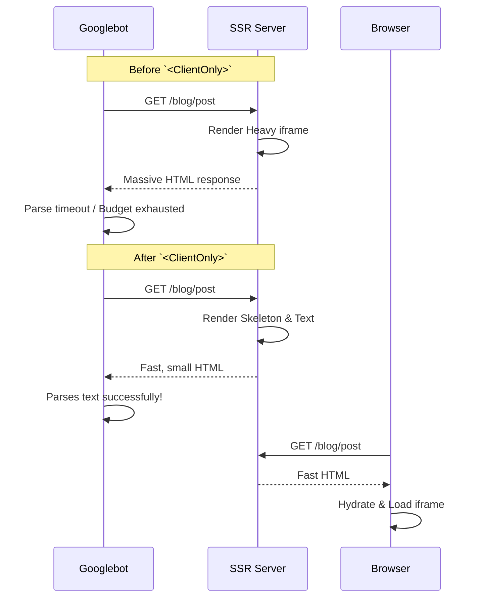

## The Blunder
Google Search Console started treating our application like a media hosting platform, throwing bizarre Video Indexing errors. Regular page indexing ground to a halt.

## The "Duh" Moment
We were server-side rendering heavy YouTube `iframe` embeds in our blog posts. Because our new domain has a tiny "crawl budget", Googlebot spent all its time trying to parse heavy media wrappers, hit its timeout, and gave up on reading our actual text content.

## The Fix
Wrapped the entire YouTube component template in `<ClientOnly>` tags with a lightweight HTML placeholder. Now the server sends a fast skeleton, Googlebot reads the text immediately, and the heavy video only loads on the client side. Problem solved! 🤦‍♂️ (See [Figure 1](#fig-1))

*Figure 1: Search engine parsing timeout vs success with ClientOnly skeleton*
