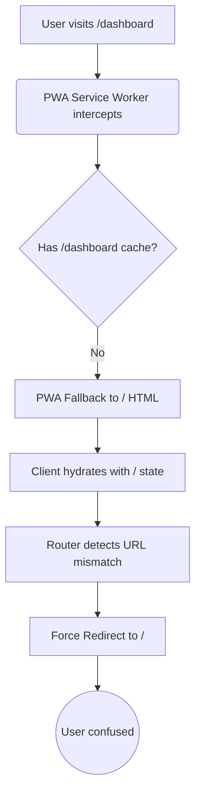

## Issue
Reloading SPA pages (like a `/dashboard` or `/profile` route) in production unexpectedly redirected the user back to the home page `/`. Local development worked perfectly fine without any redirects.

## Root Cause
Vite PWA intercepted the navigation requests in production and fell back to serving the cached `/` HTML. Since the framework hydrated with the root page's state on a different URL, the router detected a state mismatch and forcefully redirected the user back to `/` ([Figure 1](#fig-1)).

<a id="fig-1"></a>

*Figure 1: PWA navigation fallback redirect loop*

## Resolution
Disabled the PWA navigation fallback in the configuration:
```ts
pwa: { workbox: { navigateFallback: null } }
```
This lets the server environment handle navigations naturally and generate SPA shells for client-side only routes.
