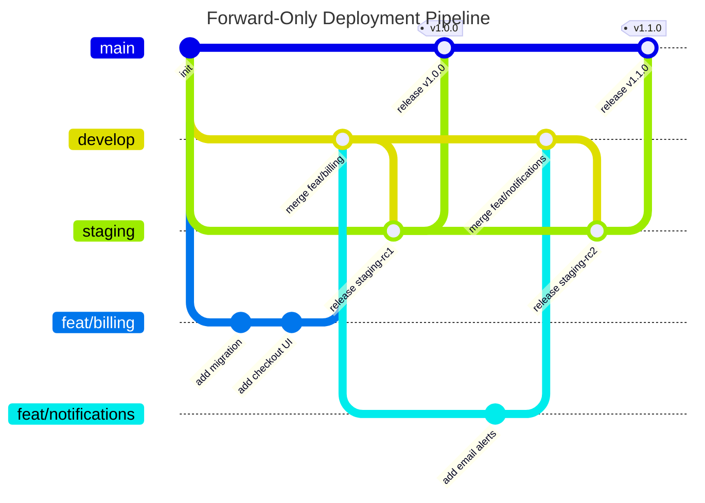

We have all been there. You run `git log --graph --oneline`, see a tangled mess of branches weaving in and out, and decide it is time to tidy things up. Everything should be a clean, elegant, straight line.

So you spin up three permanent branches: `develop`, `staging`, and `main`. You write code on `develop`, rebase things whenever history diverges, fast-forward your releases down the line, and admire your spotless commit tree.

Then you hook that repo up to modern CI/CD pipelines, and the whole setup falls apart.

Your database migrations fall out of sync. A broken feature sitting on staging blocks a critical hotfix to production. And someone on the team ends up in rebase conflict hell over code that was thrown out two weeks ago.

Using long-lived Git branches as proxies for deployment environments is an anti-pattern. Here is why permanent environment branches fail to provide true isolation, how persistent state ruins the party, and what actual production workflows look like.

---

## 1. The Branch Theater Illusion

If your `develop`, `staging`, and `main` branches sit in a single straight line, one of two things is happening behind the scenes:

1. **You are rebasing permanent branches.** You run `git rebase` on `staging` or `main`. That rewrites commit hashes, destroys your audit trail, and forces a `git push --force`. The second another developer pulls that branch or a CI runner checks it out, history breaks.
2. **You are playing "Branch Theater".** You commit on `develop`, fast-forward `staging` to match it, and then fast-forward `main` to match that.

In the second scenario, your Git tree looks like this:

```text
A --- B --- C --- D --- E (develop, staging, main)
```

If all three branches point to commit `E`, you do not have three different **code states**. You just have three bookmarks pointing to the exact same commit in your repository history. 

While `staging` and `main` may point to separate cloud infrastructure and database instances, having three identical branches provides zero isolation for feature development. A staging branch is only useful if it can hold a release candidate in isolation while you keep committing new, unverified experiments on `develop`. If `staging` is always identical to `develop`, maintaining separate environment branches is just pure ceremony.

---

## 2. Environment Branches vs. Real Isolation

The original Gitflow specification was published in 2010. It was designed primarily for versioned software releases—like desktop software, mobile builds, or scheduled release packages—where distinct version lines (`develop`, `release/*`, `hotfix/*`) had long lifecycles.

In modern continuous delivery, however, teams often misuse Gitflow by treating Git branches as environment proxies. Trying to manage deployment environments purely through Git branches creates three fundamental problems:

---

## 3. The Preview Bottlenecks Nobody Mentions

Hosting platforms love to sell us on this pitch: *"Just push your branch and get an instant preview URL!"*

For stateless frontends with zero backend dependencies, that works like magic. But the second your app connects to a real database and third-party APIs, you run into real architectural headaches:

### Bottleneck A: The Poisoned Staging Database

Code is easy to throw away. Databases are not. Database state does not magically rewind when Git rewinds.

Most teams hook their permanent `staging` branch to a single shared staging database. Here is how that bites you:

1. You create a new database migration on `develop` for a feature you want to test.
2. You push it to `staging` so you can click around the preview URL.
3. Your deployment pipeline runs your migration script (Drizzle, Prisma, Flyway) against the staging database.
4. You open the preview, test it, and realize: *"The schema design is flawed. I need to redo it."*
5. You go back to `develop` and edit or delete that migration file.

Too late. The staging database already executed that old migration and logged its hash in the migration table. The staging DB is now poisoned. Anyone else trying to deploy to staging will hit migration errors until someone manually logs into the database to drop tables or undo the ledger.

```text
[develop branch]  --> (Local DB)
[staging branch]  --> [Shared Staging DB]  <-- Poisoned by test migrations!
[main branch]     --> [Production DB]
```

### Bottleneck B: The Static Webhook Wall

Modern apps connect to third-party APIs: Stripe for billing, Clerk for auth, Resend for email, GitHub for OAuth.

Almost every single one of them expects a fixed, registered webhook callback URL, such as `https://staging-api.yoursite.com/webhooks/stripe`.

When you create an ephemeral branch deployment, you get a dynamic URL like `https://app-feat-checkout-x89f2.pages.dev`. Stripe has no idea that URL exists. Unless you build a custom proxy system just to route webhooks to random preview URLs, you are forced to use a permanent staging URL anyway.

### Bottleneck C: The Staging Traffic Jam

Say you use a single `staging` branch for previews:

* You merge Feature A into `staging` for review.
* You also merge Feature B (a quick bugfix) into `staging`.
* QA tests both, but Feature A has a critical bug and cannot ship.
* Feature B works great and needs to go to production immediately.

Now you are stuck. You cannot merge `staging` into `main` because you would accidentally ship broken Feature A. You now have to spend an afternoon cherry-picking commits and untangling Git history under pressure.

---

## 4. Code Promotion vs. Artifact Promotion

The biggest flaw in relying on environment branches (`develop` $\to$ `staging` $\to$ `main`) is that you end up **rebuilding your code** at every step.

When you merge `develop` into `staging`, your CI pipeline builds a new Docker container or JavaScript bundle. When you later merge `staging` into `main`, your CI pipeline builds *yet another* binary from `main`.

Even if the source code is identical, rebuilding artifacts across environments introduces risks: dependencies can update, environment flags can drift, and subtle build timing discrepancies can occur.

```text
Flawed Branch-Promotion Model:
develop  --> (Build Artifact 1) --> Test
  ↓ merge
staging  --> (Build Artifact 2) --> Staging Test
  ↓ merge
main     --> (Build Artifact 3) --> Deploy to Prod  <-- Untested binary!
```

A mature Continuous Delivery pipeline promotes **build artifacts**, not Git branches:

```text
Modern Artifact-Promotion Model:
Git Commit (main or feature branch)
  ↓
Build Once (Immutable Binary / Container Image)
  ↓
Deploy & Test on Staging
  ↓ (Same identical artifact)
Promote & Deploy to Production
```

By decoupling code state, environment state, and deployment artifacts, your environments reflect actual verified builds rather than branch merge gymnastics.

---

## 5. The Two Strategies That Actually Work

Stop trying to rebase deployment branches. Here are two practical ways to structure your workflow today.

### Option A: Lean Environment Promotion (Forward-Only)

*Best when:* You rely on persistent preprod infrastructure, shared staging databases, or fixed third-party webhooks.

Rather than attempting to maintain a linear history across environment branches, accept that Git is a Directed Acyclic Graph (DAG) designed to track branching paths. Move code in one direction only: **develop $\to$ staging $\to$ main**, using explicit merge commits (`--no-ff`).



Those merge commits serve as clear release checkpoints. If something breaks in production, you can roll back the release with a single command: `git revert -m 1 <commit-hash>`.

#### The Shell Script to Run It

```bash
# 1. Merge feature into develop
git checkout develop
git pull origin develop
git merge --no-ff feat/billing -m "feat: integrate billing"
git push origin develop

# 2. Promote develop to staging (Triggers preview & staging DB migration)
git checkout staging
git pull origin staging
git merge --no-ff develop -m "release(staging): promote develop to staging"
git push origin staging

# ---> PAUSE HERE: Test your preview deployment and verify migrations <---

# 3. Promote staging to production (Triggers prod deploy & prod DB migration)
git checkout main
git pull origin main
git merge --no-ff staging -m "release(prod): promote staging to main"
git tag -a v1.0.0 -m "Release v1.0.0"
git push origin main v1.0.0

# 4. Jump back to your daily driver
git checkout develop
```

**The golden rule here:** Once a migration lands on staging, it is set in stone. If it is broken, you do not rewrite it or rebase it. You write a new fix on `develop` and push that forward.

---

### Option B: Trunk-Based Development with Database Branching

*Best when:* You want to move fast, eliminate branch management overhead, and your stack supports database branching (like Neon, Supabase branches, or isolated Cloudflare D1 databases).

In this setup, you eliminate permanent `staging` and `develop` branches entirely. You maintain short-lived feature branches off **`main`**.

```text
main: -----------------------* (v1.0.0) -------------------------* (v1.1.0)
                            /                                   /
feat/auth:      ---*---*---* (Ephemeral preview + isolated DB branch)
feat/checkout:                ---*---* (Ephemeral preview + isolated DB branch)
```

1. **Branch off `main`:** Work on short-lived feature branches.
2. **Auto-spin up a database branch:** When you open a Pull Request, your CI spins up a fresh, isolated database instance cloned from production schema/data.
3. **Test in total isolation:** The preview URL talks to that temporary database branch. If your migration is broken, close the PR and the temporary database gets destroyed automatically.
4. **Build & promote artifact:** Once approved, merge into `main` and deploy the verified build artifact to production.

No staging traffic jams, no desynchronized branch state, and zero shared database pollution.

---

## 6. Summary: Which Strategy Fits Your Stack?

| Feature | The Rebase Anti-Pattern | Forward-Only Promotion (Option A) | Trunk-Based + DB Branching (Option B) |
| --- | --- | --- | --- |
| **Branches** | `main`, `staging`, `develop` (rebased) | `develop` $\to$ `staging` $\to$ `main` | `main` + short PR branches |
| **History Style** | Fake linear (broken hashes) | True DAG with clear merge points | Linear on `main` (Squash & Merge) |
| **Code vs Env State** | Confuses git pointer with env state | Explicit release pointer | Single source of truth (`main`) |
| **Deployment Model** | Rebuilds source on every branch | Branch promotion | **Artifact promotion (Build once, deploy anywhere)** |
| **Database State** | High risk of migration drift | Safe (forward-only migrations) | Zero risk (isolated DB per PR) |
| **External Webhooks** | Hard to manage | Easy (static staging URL) | Requires mockers or tunnel scripts |
| **Best For** | Anti-pattern | Monoliths, stateful apps, small teams | Serverless, modern SaaS, microservices |

---

A straight line in your Git graph looks clean in screenshots, but branch rebase hacks often mask underlying deployment state problems. 

Remember the core distinction: **Git branches track code state, deployment pipelines manage environment state, and CD systems promote build artifacts.** Aligning your workflow around those three boundaries will give you clean, reliable releases without the staging chaos.

