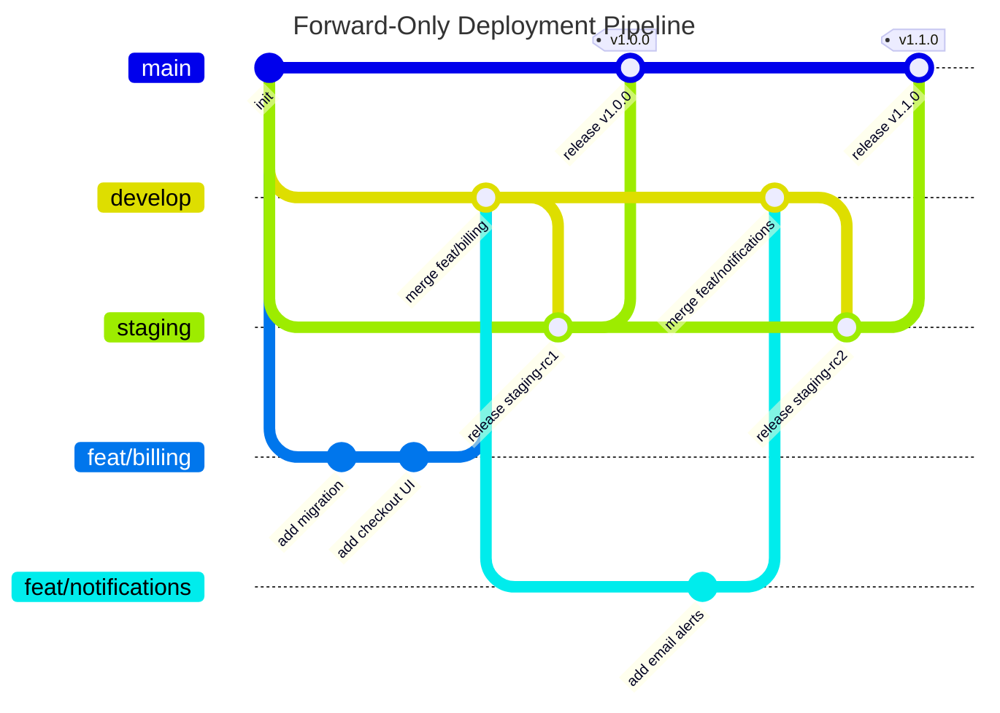

We have all been there. You run `git log --graph --oneline`, see a tangled mess of branches weaving in and out, and decide it is time to tidy things up. Everything should be a clean, elegant, straight line.

So you spin up three permanent branches: `develop`, `staging`, and `main`. You write code on `develop`, rebase things whenever history diverges, fast-forward your releases down the line, and admire your spotless commit tree.

Then you hook that repo up to Vercel, Render, or Cloudflare, and the whole setup falls apart.

Your database migrations fall out of sync. A broken feature sitting on staging blocks a critical hotfix to production. And someone on the team ends up in rebase conflict hell over code that was thrown out two weeks ago.

Chasing a perfectly linear Git graph across multiple deployment branches is an anti-pattern. Here is why classic Gitflow fails modern CI/CD, how persistent state ruins the party, and what actual production workflows look like.

---

## 1. The Branch Theater Illusion

If your `develop`, `staging`, and `main` branches sit in a single straight line, one of two things is happening behind the scenes:

1. **You are rebasing permanent branches.** You run `git rebase` on `staging` or `main`. That rewrites commit hashes, destroys your audit trail, and forces a `git push --force`. The second another developer pulls that branch or a CI runner checks it out, history breaks.
2. **You are playing "Branch Theater".** You commit on `develop`, fast-forward `staging` to match it, and then fast-forward `main` to match that.

In the second scenario, your Git tree looks like this:

```text
A --- B --- C --- D --- E (develop, staging, main)
```

If all three branches point to commit `E`, you do not have three environments. You just have three bookmarks pointing to the exact same page in the book.

A staging branch is only useful if it can hold a release candidate in isolation while you keep committing new, unverified experiments on `develop`. If `staging` is always identical to `develop`, having that extra branch is just pure ceremony.

---

## 2. Why 2010 Gitflow Doesn't Work Today

The original Gitflow specification was written in 2010. Back then, software was mostly "boxed": desktop apps, mobile builds, or tarballs released once a quarter.

In that world:

* You froze code on a dedicated release branch for weeks of manual QA.
* There was no live production database running in the cloud that could get bricked by a bad schema push.
* You did not have external webhooks pinging live servers.

Modern web development moves at a completely different speed. We push code, CI builds it, it runs migrations against a live cloud database, and it goes live in minutes.

Trying to force 2010 Gitflow into modern CI/CD platforms creates three big bottlenecks that traditional Git tutorials never warn you about.

---

## 3. The Preview Bottlenecks Nobody Mentions

Hosting platforms love to sell us on this pitch: *"Just push your branch and get an instant preview URL!"*

For stateless frontends with zero backend dependencies, that works like magic. But the second your app connects to a real database and third-party APIs, you run into real architectural headaches:

### Bottleneck A: The Poisoned Staging Database

Code is easy to throw away. Databases are not.

Most teams hook their permanent `staging` branch to a single shared staging database. Here is how that bites you:

1. You create a new database migration on `develop` for a feature you want to test.
2. You push it to `staging` so you can click around the preview URL.
3. Your deployment pipeline runs your migration script (Drizzle, Prisma, Flyway) against the staging database.
4. You open the preview, test it, and realize: *"The schema design is flawed. I need to redo it."*
5. You go back to `develop` and edit or delete that migration file.

Too late. The staging database already executed that old migration and logged its hash in the migration table. The staging DB is now poisoned. Anyone else trying to deploy to staging will hit migration errors until someone manually logs into the database to drop tables or undo the ledger.

```text
[develop branch]  --> (Local DB)
[staging branch]  --> [Shared Staging DB]  <-- Poisoned by test migrations!
[main branch]     --> [Production DB]
```

### Bottleneck B: The Static Webhook Wall

Modern apps connect to third-party APIs: Stripe for billing, Clerk for auth, Resend for email, GitHub for OAuth.

Almost every single one of them expects a fixed, registered webhook callback URL, such as `https://staging-api.yoursite.com/webhooks/stripe`.

When you create an ephemeral branch deployment, you get a dynamic URL like `https://app-feat-checkout-x89f2.pages.dev`. Stripe has no idea that URL exists. Unless you build a custom proxy system just to route webhooks to random preview URLs, you are forced to use a permanent staging URL anyway.

### Bottleneck C: The Staging Traffic Jam

Say you use a single `staging` branch for previews:

* You merge Feature A into `staging` for review.
* You also merge Feature B (a quick bugfix) into `staging`.
* QA tests both, but Feature A has a critical bug and cannot ship.
* Feature B works great and needs to go to production immediately.

Now you are stuck. You cannot merge `staging` into `main` because you would accidentally ship broken Feature A. You now have to spend an afternoon cherry-picking commits and untangling Git history under pressure.

---

## 4. The Two Strategies That Actually Work

Stop trying to rebase deployment branches. Here are the two clean ways to handle deployments today.

### Option A: The Strict Forward Promotion Flow

*Best when:* You have a shared staging database, persistent preprod infrastructure, or fixed third-party webhooks.

Forget having a linear history across environments. Git is supposed to be a Directed Acyclic Graph (DAG) that branches and merges. You move code in one direction only: **develop $\to$ staging $\to$ main**, using explicit merge commits (`--no-ff`).



Those merge commits are not "messy." They are your release checkpoints. If something breaks in production, you can roll back the entire release with one single command: `git revert -m 1 <commit-hash>`.

#### The Shell Script to Run It

```bash
# 1. Merge feature into develop
git checkout develop
git pull origin develop
git merge --no-ff feat/billing -m "feat: integrate billing"
git push origin develop

# 2. Promote develop to staging (Triggers preview & staging DB migration)
git checkout staging
git pull origin staging
git merge --no-ff develop -m "release(staging): promote develop to staging"
git push origin staging

# ---> PAUSE HERE: Test your preview deployment and verify migrations <---

# 3. Promote staging to production (Triggers prod deploy & prod DB migration)
git checkout main
git pull origin main
git merge --no-ff staging -m "release(prod): promote staging to main"
git tag -a v1.0.0 -m "Release v1.0.0"
git push origin main v1.0.0

# 4. Jump back to your daily driver
git checkout develop
```

**The golden rule here:** Once a migration lands on staging, it is set in stone. If it is broken, you do not rewrite it or rebase it. You write a new fix on `develop` and push that forward.

---

### Option B: Trunk-Based Development with Ephemeral Databases

*Best when:* You want to move fast, you hate branch management, and your database tool supports instant branching (like Neon, Supabase branches, or isolated Cloudflare D1 databases).

In this setup, you kill `staging` and `develop` entirely. You only keep **`main`**.

```text
main: -----------------------* (v1.0.0) -------------------------* (v1.1.0)
                            /                                   /
feat/auth:      ---*---*---* (Ephemeral preview + isolated DB branch)
feat/checkout:                ---*---* (Ephemeral preview + isolated DB branch)
```

1. **Branch off `main`:** You work on short-lived feature branches.
2. **Auto-spin up a database branch:** When you open a Pull Request, your CI spins up a fresh, isolated database instance cloned from production schema.
3. **Test in total isolation:** The preview URL talks to that temporary database branch. If your migration is broken, who cares? Close the PR, and the temporary database gets destroyed automatically.
4. **Squash and merge into `main`:** Once the PR is approved, squash-merge into `main`. The production database runs the migration, and production deploys.

No staging branches, no merge traffic jams, and zero shared state issues.

---

## 5. Which Strategy Fits Your Project?

| Feature | The Rebase Anti-Pattern | Forward-Only (Option A) | Trunk-Based + DB Branching (Option B) |
| --- | --- | --- | --- |
| **Branches** | `main`, `staging`, `develop` (rebased) | `develop` $\to$ `staging` $\to$ `main` | `main` + short PR branches |
| **History Style** | Fake linear (broken hashes) | True DAG with clear merge points | Linear on `main` (Squash & Merge) |
| **Database State** | High risk of migration drift | Safe (forward-only migrations) | Zero risk (isolated DB per PR) |
| **Preview Reliability** | Fragile and prone to desync | Static and predictable | Completely disposable |
| **External Webhooks** | Hard to manage | Easy (static staging URL) | Requires mockers or tunnel scripts |
| **Best For** | Nobody | Monoliths, stateful apps, small teams | Serverless, microservices, modern stacks |

---

A straight line in your Git graph looks pretty in a screenshot, but it usually means you are either running branch theater or playing Russian roulette with your history.

If your project has a persistent database and external webhooks, use Option A: treat `staging` as a one-way gate, never rebase it, and let `--no-ff` merge commits do their job.

And if you have modern database tooling that can spin up isolated data per branch, go with Option B: delete `staging` entirely and run trunk-based. Just don't get stuck in the messy middle.
