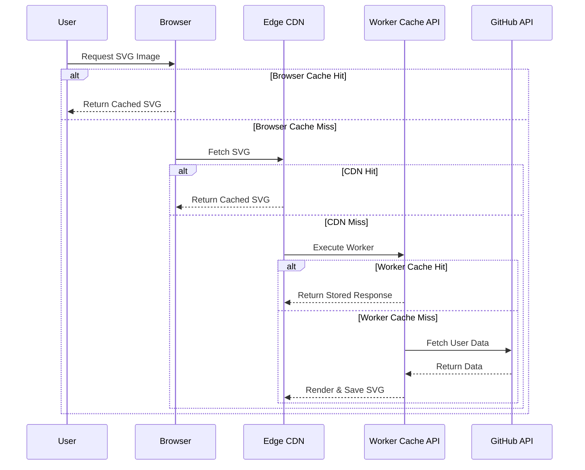

## 1. The Challenge
When building the [`github-streak`](https://github.com/rahuldhole/github-streak) project, one of the immediate hurdles we faced was performance and rate-limiting. Rendering GitHub streak SVGs requires making expensive calls to the GitHub API. Without aggressive caching, we risked quickly burning through our API rate limits and serving slow responses to end-users whenever the CDN cache missed.

Here is the high-level request flow that highlighted the need for multiple layers of caching:


*Figure: Request flow highlighting multiple caching layers*

Rolling out caching was essential to scale the project. However, implementing caching at the edge is rarely straightforward. It introduced a cascade of subtle edge cases, taking us on a journey through crashing runtimes and stale browser content.

## 2. The Evolution of Our Caching Strategy

Our caching strategy evolved through several iterations as we learned and adapted. Here's a quick summary of the approaches we tried:

| Iteration | Strategy | Pros | Cons / Challenges |
| :--- | :--- | :--- | :--- |
| **V1** | HTTP `Cache-Control` headers | Easy to implement, works natively | Redundant Worker executions on CDN misses |
| **V2** | Cloudflare Cache API | Saves GitHub API calls, prevents redundant runs | Crashed on Netlify (Deno sandbox blocked writes) |
| **V3** | Normalized Cache Keys | Prevents arbitrary query params from bypassing cache | Required explicit query string parsing logic |
| **V4** | Versioned URLs (`&v=`) | Instantly busts stale images and browser cache | Requires an app version bump on changes |

*Table: Evolution of the caching strategy over four iterations*

Here is how we navigated through each phase:

1. **The Starting Point: Basic Cache Headers:** We initially relied on standard HTTP headers: `Cache-Control: public, max-age=3600, s-maxage=7200` for SVGs, and `max-age=86400` for the landing page. This was a good start, but it didn't prevent redundant Worker executions if the CDN missed.
2. **Stepping Up: Worker-Level Cache API:** To prevent unnecessary Worker executions and API calls when the CDN missed, we adopted the Cloudflare Cache API, saving responses asynchronously using `executionCtx.waitUntil(cache.put(cacheKey, response))`.
3. **The Sandbox Roadblock:** When we deployed the same code to Netlify Edge Functions, the application suddenly crashed. The reason? Netlify runs on Deno, which enforces a strict sandbox. The `cache.put()` call internally attempted a filesystem write that the Deno runtime naturally blocked.
4. **Cache Key Headaches:** We also noticed that users modifying query parameters (or simply reordering them) generated distinct cache keys. This bypassed the cache entirely and forced redundant API calls.
5. **The Stale Content Trap:** Because we aggressively cached the landing page for 24 hours, users were stuck seeing outdated versions of the UI and old markdown snippets even after new updates were pushed to production.

## 3. Reaching a Robust Solution

We tackled these challenges iteratively, ultimately arriving at a robust, multi-layered caching architecture:

- **Graceful Sandbox Degradation:** To support both Cloudflare and Netlify seamlessly, we treated the Worker Cache API as a "best-effort" optimization. We wrapped the async write in a `.catch()` block. On Cloudflare, it successfully populates the cache; on Netlify, it gracefully logs a warning without crashing, falling back to Netlify's native CDN caching (configured via the `Netlify-CDN-Cache-Control` header).
  ```typescript
  executionCtx.waitUntil(
    cache.put(cacheKey, finalResponse.clone()).catch((cacheErr: any) => {
      console.warn('Cache write skipped:', cacheErr.message)
    })
  )
  ```

- **Normalizing the Cache Key:** Instead of using the raw request URL as the cache key, we constructed a normalized URL containing only the explicitly supported query parameters (`user`, `theme`, and `type`). This ensured that `?user=foo&theme=dark` and `?theme=dark&user=foo` efficiently hit the exact same cache entry.

- **Browser Cache Invalidation:** To fix the stale landing page and image issues, we introduced a cache-busting mechanism. We imported the application version from `package.json` and appended it as a `&v=${version}` query parameter to the generated image URLs. Now, whenever we bump the package version, all users instantly receive the latest assets.
