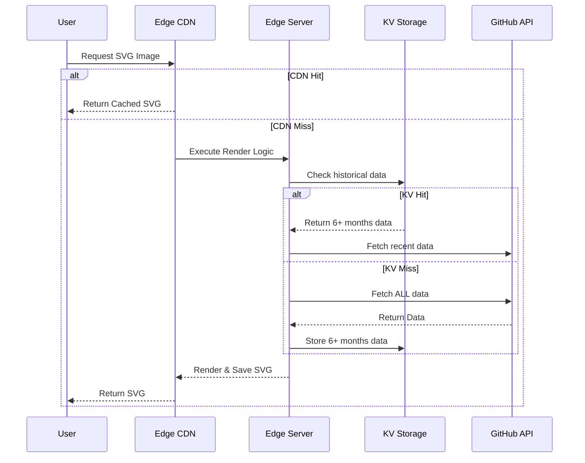

## 1. The Challenge
When building the [`github-streak`](https://github.com/rahuldhole/github-streak) project, one of the immediate hurdles I faced was performance and rate-limiting. Rendering GitHub streak SVGs requires making expensive calls to the GitHub API. Without aggressive caching, I risked quickly burning through my API rate limits and serving slow responses to end-users.

Here is the high-level request flow ([Figure 1](#fig-1)) that highlighted the need for multiple layers of caching:

*Figure 1: Request flow highlighting the dual caching layers (CDN & KV)*

## 2. The Evolution of My Caching Strategy

My caching strategy evolved through several iterations as I learned and adapted. Here's a quick summary of the approaches I tried ([Table 1](#table-1)):

| Iteration | Strategy | Pros | Cons / Challenges |
| :--- | :--- | :--- | :--- |
| **V1** | Plain CDN caching | Easy to implement | Cache invalidation issues; users saw outdated SVGs |
| **V2** | Nitro JS SWR Cache | Stale-while-revalidate | Cached API errors; painfully long cache invalidation |
| **V3** | Versioned Cache Keys | Instantly busts stale images on demand | N/A |
| **V4** | KV Storage + CDN | High performance, avoids recalculations | More complex state management |

*Table 1: Evolution of the caching strategy over four iterations*

Here is how I navigated through each phase:

1. **Attempt 1: Plain CDN Caching:** I initially started with plain SVG caching directly on the CDN. This seemed fine at first, but I quickly ran into a severe cache invalidation problem. The SVG update was controlled entirely by the edge CDN, which meant it was showing the same exact SVG even after a user's GitHub contributions were updated.
2. **Attempt 2: Nitro JS SWR:** To fix the staleness, I tried using the Nitro JS SWR (stale-while-revalidate) cache. It sounded perfect, but it had a fatal flaw: it started caching the errors too! If the GitHub API hiccuped, users would see an error SVG for hours, and I had to wait painfully long for its cache invalidation to naturally expire.
3. **Attempt 3: Manual Version Invalidation:** I needed a manual override for developer mistakes. I added a version number in `package.json` to force invalidate the cache. Even if an error or outdated image was stubbornly cached in the CDN, I could just update the `cacheVersion` key in `package.json` to instantly bust the cache across the board.
4. **Attempt 4: KV Storage for Performance:** Even with the invalidation fixed, the underlying performance problem remained. Fetching a user's entire history on every cache miss was slow. To solve this, I started caching older GitHub contributions (anything older than 6 months) in KV storage for a month. This way, I don't have to recalculate historical contributions on the fly—I just stitch the historical KV data with the recent live data, and then cache the final rendered SVG on the simple CDN.

## 3. Reaching a Robust Solution

Ultimately, I arrived at a robust architecture utilizing two distinct types of caching:

1. **CDN Cache:** For the final, rendered SVG images.
2. **KV Cache:** For the raw, historical GitHub contribution data (older than 6 months).

Crucially, both of these caching layers are strictly controlled by cache versioning. They can be busted globally by the developer updating the `cacheVersionKey`, or on a per-user basis via a `?v=` query parameter. This gives me the perfect balance of lightning-fast performance and total control over cache invalidation.
