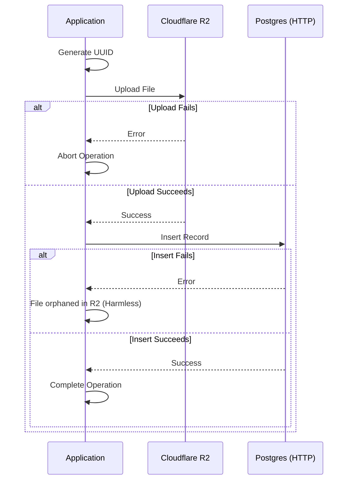

## Incident Summary
**Issue:** The application encountered fatal `500 Internal Server Error` responses when performing core write operations like generating documents or saving records. 
**Error Message:** `Error: No transactions support in http driver`

## Root Cause
The application uses Drizzle ORM connected to a Serverless Postgres database. For Cloudflare Workers compatibility (to avoid WebSocket I/O limitations), the database connection dynamically uses a stateless HTTP driver. 

However, several core data models and webhook handlers were wrapping database queries inside native `db.transaction(async tx => { ... })` blocks. Because HTTP connections are inherently stateless, they cannot maintain an open connection session to execute a `BEGIN`, run arbitrary JavaScript logic (like waiting for Cloudflare R2 uploads), and then issue a `COMMIT`. This fundamental incompatibility caused the driver to throw an exception immediately.

## Resolution
To resolve the issue while preserving data consistency across distributed systems (Postgres + Cloudflare R2 + Usage Ledgers), we implemented a modified Saga/compensating-transaction pattern ([Figure 1](#fig-1)):

*Figure 1: Compensating transaction flow handling external storage and database*

1. **Removed Native Transactions:** Completely removed all `db.transaction()` wrappers across the application models.
2. **Pre-Generated UUIDs:** Migrated from relying on Postgres `RETURNING id` to eagerly generating IDs in the Node/Worker runtime using `globalThis.crypto.randomUUID()`.
3. **Reordered Network Operations:** Shifted all external side-effects (specifically Cloudflare R2 object uploads) to occur *first* in the function logic. 
   - *Impact:* If an R2 upload fails, the operation aborts cleanly before any database state is mutated. If a database query fails *after* a successful R2 upload, the system simply leaves an orphaned (but inaccessible and harmless) file in the bucket rather than corrupting user data or ledger quotas.
4. **Sequential Execution:** Executed dependent database queries sequentially using `await`. Because side-effects were resolved upfront, the chance of partial failure between sequential database inserts is practically zero, and the database schema's foreign key cascades (`onDelete: cascade`) ensure structural integrity.

## Lessons Learned
1. **Serverless Limitations:** Stateful database concepts like `BEGIN/COMMIT` transactions cannot be safely relied upon in serverless edge runtimes that mandate HTTP data-fetching. 
2. **Side-Effect Management:** Always execute non-transactional side-effects (like interacting with blob storage or third-party APIs) as early as possible in a pipeline to minimize the blast radius of partial failures.
3. **TypeScript Limitations:** Driver-specific constraints (like `.transaction()` missing from the HTTP driver) were masked by union types that incorrectly suggested full feature parity across environments. 

## Action Items
- Monitor the R2 bucket growth over time to evaluate if an orphaned-file cleanup cron job is necessary.
- Ensure all future database models adhere to the "Network First, DB Second" pattern.

See [Table 1](#table-1) for a breakdown of these phases.

| Phase | Action | Failure Consequence |
| --- | --- | --- |
| 1 | Generate UUIDs | None (Local Execution) |
| 2 | Network/R2 Uploads | Request Aborted cleanly |
| 3 | Database Inserts | Orphaned File in R2 (Safe) |

*Table 1: Action items and failure consequences*
