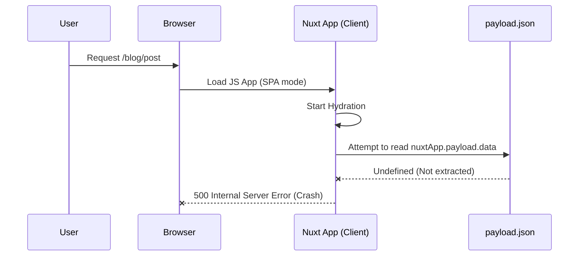

## Summary

A 500 error occurred when reloading or navigating to ISR routes (e.g., `/blog/**`). The failure was caused by `nuxtApp.payload.data` being `undefined` during client-side hydration.

---

## Impact

* Affected routes: `/blog/**` and other ISR paths
* Trigger: Page reload or SPA → ISR navigation
* Result: Runtime crash → 500 error

---

## Root Cause

Conflicting route rules in the configuration:

```ts
'/**': { ssr: false }     // SPA catch-all
'/blog/**': { isr: 3600 } // ISR requires SSR
```

* The SPA catch-all disabled SSR globally.
* ISR routes expected SSR + payload.
* Client hydration attempted to access the missing payload, leading to a crash.


*Figure: Payload extraction failure during hydration*

Related upstream issue:
https://github.com/nuxt/nuxt/issues/34856

---

## Resolution

### Option A: Official Recommended Solution (Applied)

1. **Explicit Route Rules**: Remove the global SPA catch-all (`/**: { ssr: false }`) which disables SSR globally. Instead, define explicit rendering modes for each route group in `nuxt.config.ts`:
   ```ts
   routeRules: {
     '/app/**': { ssr: false },
     '/dashboard/**': { ssr: false },
     '/blog/**': { isr: 3600 }
   }
   ```

2. **Inline Route Rules**: Enable `experimental: { inlineRouteRules: true }` to allow defining rules (like `prerender: true` for SSG) directly inside `.vue` pages using the `defineRouteRules` macro.

3. **Re-enable Payload Extraction**: Keep `payloadExtraction: true` (default) to ensure efficient data loading and caching.

### Option B: Legacy "Trick" (Alternative)

If explicit routing is too complex, the following "trick" can bypass the hydration crash:

1. **Disable payload extraction**:
   ```ts
   experimental: {
     payloadExtraction: false
   }
   ```

2. **Client-side safeguard**:
   ```ts
   // app/plugins/payload-fix.ts
   export default defineNuxtPlugin((nuxtApp) => {
     if (process.client && !nuxtApp.payload?.data) {
       nuxtApp.payload.data = reactive({})
     }
   })
   ```

---

## Trade-offs

| Approach | Advantages | Disadvantages |
| --- | --- | --- |
| **Option A: Official Way** | Cleanest architecture, fully supported by Nuxt, best performance. | Requires explicit maintenance of route patterns. |
| **Option B: Legacy Trick** | Quickest fix, bypasses hydration crashes without strict routing. | Inlines payloads in HTML (larger responses), bypasses standard Nuxt hydration logic. |

*Table: Trade-offs between official and legacy solutions*

---

## Prevention / Next Steps

* **Never use a global SPA (`ssr: false`) fallback** if your app contains ISR or SSG routes.
* **Use `defineRouteRules`** in pages for granular control over pre-rendering.
* **Maintain explicit route groupings** in `nuxt.config.ts` for large modules.
