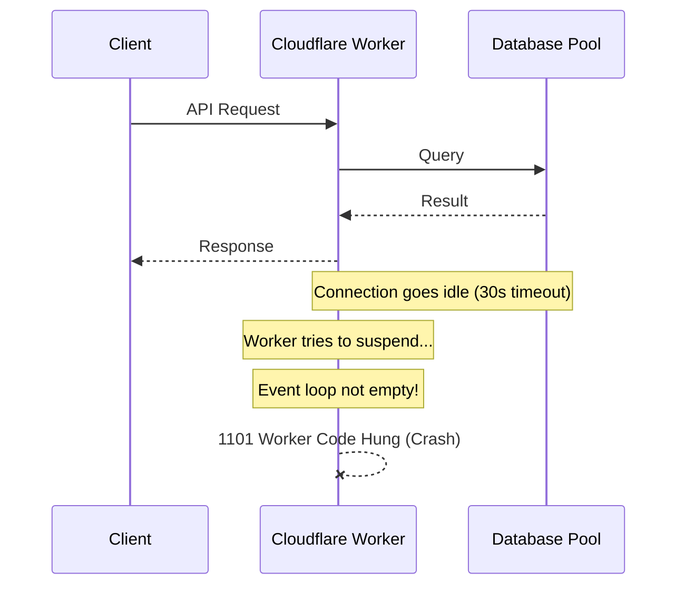

## Executive Summary
In production, a core API endpoint was encountering severe stability issues: crashing with `500 Internal Server Error` and triggering `1101 Worker Code Hung` exceptions from the Cloudflare Workers runtime. The root cause was twofold: (1) a `30000`ms (30s) connection pool idle timeout that kept WebSockets active indefinitely—violating Cloudflare’s stateless suspension model—and (2) a lack of query safety in the API handler, which crashed when database connections failed or when dates were returned as raw strings. 

Both issues were resolved by aggressively reducing the database connection pool idle timeout to `1000`ms, wrapping database operations in a try-catch fallback pattern, and safe-guarding date serialization.

---

## The Incident

### Symptoms & Timeline
1. **Immediate Crashing (500):** Requests to the API endpoint immediately failed in production with 500 errors. 
2. **Workers Runtime Hangs (1101):** The Cloudflare Workers runtime terminated incoming requests with the error: 
   > *“The Workers runtime canceled this request because it detected that your Worker's code had hung and would never generate a response.”*
3. **Investigation:** The unit tests were passing locally in standard Node environments, masking the specific architectural and serverless-related pitfalls under Cloudflare Workers.

---

## Root Cause Analysis

### 1. The Event Loop Hang (`idleTimeoutMillis`)
To handle database cold starts, the connection pool was configured with:
```typescript
const pool = new Pool({
  connectionString,
  connectionTimeoutMillis: 10000,
  max: 10,
  idleTimeoutMillis: 30000, // 30 seconds
})
```
While this keeps connections warm in standard Node environments, in Cloudflare Workers **WebSockets must not be kept active indefinitely**. An idle timeout of 30 seconds meant active WebSockets remained in the event loop well after the request finished. Because the event loop never emptied, the Cloudflare Workers runtime assumed the code had hung and aborted the workers with a severe **1101 error** ([Figure 1](#fig-1)).

<a id="fig-1"></a>

*Figure 1: Worker event loop crash due to idle WebSocket connection*

### 2. Lack of Resilient DB Fallbacks
Unlike other endpoints, this specific endpoint had no guardrails around database connection failures. If the serverless database was waking up (cold start) or temporarily unreachable, the database query failed, triggering a generic HTTP 500.

### 3. Date Serialization Crash
Depending on how the serverless driver returned query records, timestamp fields were sometimes returned as a string rather than a JavaScript `Date` object. Calling `.toISOString()` on a string threw a `TypeError`, causing a synchronous crash.

---

## Resolution

### 1. WebSocket Pool Optimization
We modified the database configuration to aggressively prune connection resources:
```diff
   const pool = new Pool({ 
     connectionString,
     connectionTimeoutMillis: 10000,
     max: 10,                        
-    idleTimeoutMillis: 30000,       
+    idleTimeoutMillis: 1000,        // Let the event loop empty so Worker suspends safely
   })
```
By reducing the idle timeout to `1000`ms, all active WebSockets are aggressively closed after queries complete. The event loop is permitted to empty, allowing Cloudflare Workers to suspend/resume gracefully.

### 2. Resilient API Try-Catch Fallback
We refactored the endpoint logic to intercept database-level failures and gracefully fallback to clean, default states:
```typescript
  let maxCount = 1
  let results: any[] = []
  let total = 0

  try {
    const db = getDb(event)
    // Fetch limits and perform the main query
    const listResult = await DataModel.list(event, userId, { page, limit, filter })
    results = listResult.items || []
    total = listResult.total || 0
  } catch (dbErr) {
    console.error('⚠️ Database query error, falling back to safe defaults:', dbErr)
    maxCount = 1 // Standard fallback limit
    results = []
    total = 0
  }
```

### 3. Safe Date Stringification
We safe-guarded the date serialization mapping so it dynamically handles strings or missing dates:
```typescript
updatedAt: row.updatedAt instanceof Date 
  ? row.updatedAt.toISOString() 
  : (row.updatedAt ? new Date(row.updatedAt).toISOString() : new Date().toISOString())
```

---

## Lessons Learned & Prevention

1. **Be Mindful of the Event Loop in Serverless:** Never keep WebSockets, timeouts, or interval loops active past the lifecycle of a request in Cloudflare Workers. Keep idle timeouts as low as possible (`1000`ms) to allow the event loop to empty.
2. **Defensive API Patterns:** Wrap user-critical page loads in robust try-catch fallbacks. Users should still be able to load empty states or free-tier experiences gracefully during database cold starts or transient connection errors.
3. **Safe String/Object Casting:** Never assume database drivers will return native JS Date objects in all environments. Always perform type validation or wrapper checks (`instanceof Date`) before calling date-specific methods.
